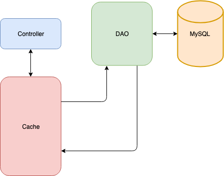

# RSVP System

## Introduction

In this activity, you will create a basic CRUD REST web service and configure it to use Spring Data caching.

## System Design

The system we'll build is a simple REST web service that keeps track of RSVPs to an event.

### Model

The application keeps track of three items for each RSVP:

* A unique ID
* The guest name
* The total number of people attending

### Database

The database consists of a single table:

```sql
create schema if not exists rsvp;
use rsvp;

create table if not exists rsvp (
 rsvp_id int not null auto_increment primary key,
    guest_name varchar(50) not null,
    total_attending int not null
);
```

### REST API

The REST API for this application consists of five endpoints:

```
Create RSVP
===========
URL: `/rsvps`
HTTP Method: `POST`
RequestBody: RSVP data
ResponseBody: RSVP data + ID

Get RSVP
========
URL: `/rsvps/{id}`
HTTP Method: `GET`
RequestBody: None
ResponseBody: RSVP data

Get All RSVPs
=============
URL: `/rsvps`
HTTP Method: `GET`
RequestBody: None
ResponseBody: Array of RSVP data

Update RSVP
===========
URL: `/rsvps/{id}`
HTTP Method: `PUT`
RequestBody: RSVP data
ResponseBody: None

Delete RSVP
===========
URL: `/rsvps/{id}`
HTTP Method: `DELETE`
RequestBody: None
ResponseBody: None
```

### Cache

The RSVP application is a typical REST CRUD web service with the addition of a caching layer to reduce the number of database calls the application has to make.



## Building the System

We will build the system in the following steps:

1. Create the database.
2. Create the project.
3. Create the model.
4. Create the repository.
5. Implement tests for the repository.
6. Implement REST API.
7. Configure caching.

### Step 1: Create the Database

Open MySQL Workbench and run the following SQL scripts, which will create the `rsvp` and `rsvp_test` databases.

```sql
create schema if not exists rsvp;
use rsvp;

create table if not exists rsvp (
 rsvp_id int not null auto_increment primary key,
    guest_name varchar(50) not null,
    total_attending int not null
);
```

```sql
create schema if not exists rsvp_test;
use rsvp_test;

create table if not exists rsvp (
 rsvp_id int not null auto_increment primary key,
    guest_name varchar(50) not null,
    total_attending int not null
);
```

### Step 2: Create the Project

The next step is to create the application.  We'll use the Spring Initializr to create our project. Go to `start.spring.io`, and enter the following information:

- Group = com.twou
- Artifact = rsvp
- Name = RsvpService
- Package name = com.twou.rsvp
- Java = 8
- Dependencies = Spring Web, Spring Data JPA, MySQL Driver, Spring cache abstraction

Download the project, copy it into your working directory, and open the project in IntelliJ.

#### API Main Database Configuration (15 min.)

The purpose of this section is to show learners how to configure the connection to MySQL using the `application.properties` file.

The database connection configuration for the application is contained in the `application.properties` file, found in `src > main > resources`.

* Have everyone open this file and add the following entries:

```java
spring.datasource.url: jdbc:mysql://localhost:3306/rsvp?useSSL=false&serverTimezone=UTC&allowPublicKeyRetrieval=true
spring.datasource.username: root
spring.datasource.password: rootroot
```

> **Note:** If the `serverTimezone=UTC` does not work on your machine, it may be necessary to change the UTC to a more specific time zone setting based on your location, such as `serverTimezone=US/Central`.

#### Test Database Configuration (15 min)

The database connection configuration for the tests is contained in `application.properties` file located in `src > test > resources'.

* Have everyone add the resources directory, in the `src/test` folder.

* Have everyone create a new `application.properties` file in this folder.

* Add the following entries to this file. Note that the schema name for this one is `moto_inventory_test`:

    ```java
    spring.datasource.url: jdbc:mysql://localhost:3306/rsvp_test?useSSL=false&serverTimezone=UTC&allowPublicKeyRetrieval=true
    spring.datasource.username: root
    spring.datasource.password: rootroot
    ```

> **Note:** If the `serverTimezone=UTC` does not work on your machine, it may be necessary to change UTC to a more specific time zone setting based on your location, such as `serverTimezone=US/Central`.


### Step 3: Create the Model

Now we will create the model object for our application. This Java class represents the RSVP information and matches the fields in the database.

Create a new file called `com.twou.rsvp.model.Rsvp.java`, and add the following code:

```java
package com.twou.rsvp.model;

import com.fasterxml.jackson.annotation.JsonIgnoreProperties;

import javax.persistence.*;
import java.util.Objects;

@Entity
@JsonIgnoreProperties({"jsonLazyInitializer", "handler"})
@Table(name="Rsvp")
public class Rsvp {
    @Id
    @GeneratedValue(strategy = GenerationType.IDENTITY)
    @Column(name="rsvp_id")
    private Long id;
    private String guestName;
    private int totalAttending;

    public Long getId() {
        return id;
    }

    public void setId(Long id) {
        this.id = id;
    }

    public String getGuestName() {
        return guestName;
    }

    public void setGuestName(String guestName) {
        this.guestName = guestName;
    }

    public int getTotalAttending() {
        return totalAttending;
    }

    public void setTotalAttending(int totalAttending) {
        this.totalAttending = totalAttending;
    }

    @Override
    public boolean equals(Object o) {
        if (this == o) return true;
        if (o == null || getClass() != o.getClass()) return false;
        Rsvp rsvp = (Rsvp) o;
        return Objects.equals(id, rsvp.id) && Objects.equals(guestName, rsvp.guestName) && Objects.equals(totalAttending, rsvp.totalAttending);
    }

    @Override
    public int hashCode() {
        return Objects.hash(id, guestName, totalAttending);
    }

    @Override
    public String toString() {
        return "Rsvp{" +
                "id=" + id +
                ", guestName='" + guestName + '\'' +
                ", totalAttending=" + totalAttending +
                '}';
    }
}
```

Items to note about this code:

* This class must implement the Serializable interface so the caching framework can cache `Rsvp` objects. Serializable is a **marker** interface that indicates that an implementing class can be serialized and deserialized. Marker interfaces have no properties or defined methods.

### Step 4: Create the repository

Create a new Interface called ```com.twou.rsvp.repository.RsvpRepository.java``` and add the following code:

```java
package com.twou.rsvp.repository;

import com.twou.rsvp.model.Rsvp;
import org.springframework.data.jpa.repository.JpaRepository;
import org.springframework.stereotype.Repository;

@Repository
public interface RsvpRepository extends JpaRepository<Rsvp, Long> {
}
```

### Step 5: Implement tests for the repository

Now we will implement the unit tests for the repository using TDD, Red/Green/Refactor, and AAA techniques. 

Create a new Java class called ```com.twou.rsvp.RsvpRepositoryTests.java``` under ```src/test/java```. Add the following code to your test suite:

```java
package com.twou.rsvp;

import com.twou.rsvp.model.Rsvp;
import com.twou.rsvp.repository.RsvpRepository;
import org.junit.jupiter.api.Test;
import static org.junit.jupiter.api.Assertions.*;
import org.springframework.beans.factory.annotation.Autowired;
import org.springframework.boot.test.autoconfigure.jdbc.AutoConfigureTestDatabase;
import org.springframework.boot.test.autoconfigure.orm.jpa.DataJpaTest;

import java.util.List;
import java.util.Optional;

@DataJpaTest
@AutoConfigureTestDatabase(replace = AutoConfigureTestDatabase.Replace.NONE)
public class RsvpRepositoryTests {

    @Autowired
    private RsvpRepository repo;

    @Test
    public void addGetDeleteRsvp() {
        Rsvp rsvp = new Rsvp();
        rsvp.setGuestName("John Doe");
        rsvp.setTotalAttending(2);
        rsvp = repo.save(rsvp);
        Optional<Rsvp> fromDao = repo.findById(rsvp.getId());
        assertEquals(fromDao.get(), rsvp);
        repo.deleteById(rsvp.getId());
        fromDao = repo.findById(rsvp.getId());
        assertFalse(fromDao.isPresent());
    }

    @Test
    public void getAllRsvps() {
        Rsvp rsvp = new Rsvp();
        rsvp.setGuestName("Sally Smith");
        rsvp.setTotalAttending(4);
        repo.save(rsvp);

        rsvp = new Rsvp();
        rsvp.setGuestName("George Smith");
        rsvp.setTotalAttending(3);
        repo.save(rsvp);

        List<Rsvp> rsvps = repo.findAll();

        assertEquals(2, rsvps.size());
    }

    @Test
    public void updateRsvp() {
        Rsvp rsvp = new Rsvp();
        rsvp.setGuestName("Joe Jones");
        rsvp.setTotalAttending(5);
        rsvp = repo.save(rsvp);

        rsvp.setGuestName("NEW NAME");
        repo.save(rsvp);

        Optional<Rsvp> fromDao = repo.findById(rsvp.getId());
        assertEquals(rsvp, fromDao.get());
    }
}
```


### Step 6: Implement REST API

With our repository in place and tested, it is time to implement the controller connecting the REST API to the repository. This is a basic Spring REST controller and should be familiar to you. 

Create a file called ```com.twou.rsvp.controller.RsvpController.java``` and add the following code:

```java
package com.twou.rsvp.controller;

import com.twou.rsvp.model.Rsvp;
import com.twou.rsvp.repository.RsvpRepository;
import org.springframework.beans.factory.annotation.Autowired;
import org.springframework.http.HttpStatus;
import org.springframework.web.bind.annotation.*;

import java.util.List;

@RestController
@RequestMapping("/rsvp")
public class RsvpController {
    @Autowired
    private RsvpRepository repo;

    @PostMapping
    @ResponseStatus(HttpStatus.CREATED)
    public Rsvp createRsvp(@RequestBody Rsvp rsvp) {
        System.out.println("Creating RSVP: " + rsvp);
        return repo.save(rsvp);
    }

    @GetMapping
    @ResponseStatus(HttpStatus.OK)
    public List<Rsvp> getAllRsvps() {
        System.out.println("Getting all RSVPs");
        return repo.findAll();
    }

    @PutMapping("/{id}")
    @ResponseStatus(HttpStatus.NO_CONTENT)
    public void updateRsvp(@PathVariable Long id, @RequestBody Rsvp rsvp) {
        if (id != rsvp.getId()) {
            throw new RuntimeException("You did it wrong.");
        }
        System.out.println("Updating RSVP with id " + id);
        repo.save(rsvp);
    }

    @DeleteMapping("/{id}")
    @ResponseStatus(HttpStatus.NO_CONTENT)
    public void deleteRsvp(@PathVariable Long id) {
        System.out.println("Deleting RSVP with id " + id);
        repo.deleteById(id);
    }

    @GetMapping("/{id}")
    @ResponseStatus(HttpStatus.OK)
    public Rsvp getRsvpById(@PathVariable Long id) {
        System.out.println("Getting RSVP with id " + id);
        return repo.findById(id).get();
    }
}
```

### Step 7: Configure Caching

The final step in our project is to configure caching. As noted in the previous system design diagram, we will do this at the controller level. We will use the default implementation (which is just a `ConcurrentHashMap`) for this tutorial.

Because we're using the Spring cache abstraction, the choice of caching library will not require any changes to our code. We could swap out the default implementation for any of the supported cache providers, such as Redis.

#### 7.1 Annotate the Main Application Class

We enable caching by applying the ```@EnableCaching``` annotation to the main ```Application``` class of our project. Open ```com.twou.rsvp.RsvpServiceApplication.java``` and add the ```@EnableCaching``` class-level annotation. 

Your code should look like this:

```java
@SpringBootApplication
@EnableCaching
public class RsvpServiceApplication {

	public static void main(String[] args) {
		SpringApplication.run(RsvpServiceApplication.class, args);
	}
}
```

#### 7.2 Annotate the Controller

The method-level annotations we will apply to the controller dictate the caching behavior of our application. We will use the following annotations:

##### @CacheConfig

This annotation allows us to specify the name of the cache our code will use.

##### @Cacheable

This annotation indicates that the result of the given method can be cached. When the annotated method is invoked, the caching framework checks to see if the method as been previously invoked with the given parameters and if there is a value in the cache. If no value is found in the cache, the method is invoked; otherwise, the cached value is returned.

##### @CacheEvict

This annotation indicates that the object with the given key should be removed from the cache when the annotated method is invoked.

##### @CachePut

This annotation specifies that the annotated method should be run and the return value of the method added to the cache.
We can specify the key that should be used when adding the result to the cache. 
For example: @CachePut(key = "#result.getId()")


Open ```com.twou.rsvp.controller.RsvpController.java``` and modify the code so it looks like this:

```java
package com.twou.rsvp.controller;

import com.twou.rsvp.model.Rsvp;
import com.twou.rsvp.repository.RsvpRepository;
import org.springframework.beans.factory.annotation.Autowired;
import org.springframework.cache.annotation.CacheConfig;
import org.springframework.cache.annotation.CacheEvict;
import org.springframework.cache.annotation.CachePut;
import org.springframework.cache.annotation.Cacheable;
import org.springframework.http.HttpStatus;
import org.springframework.web.bind.annotation.*;

import java.util.List;

@RestController
@RequestMapping("/rsvp")
@CacheConfig(cacheNames = {"rsvps"})

public class RsvpController {
    @Autowired
    private RsvpRepository repo;

    @PostMapping
    @CachePut(key = "#result.getId()")
    @ResponseStatus(HttpStatus.CREATED)
    public Rsvp createRsvp(@RequestBody Rsvp rsvp) {
        System.out.println("Creating RSVP: " + rsvp);
        return repo.save(rsvp);
    }

    @GetMapping
    @ResponseStatus(HttpStatus.OK)
    public List<Rsvp> getAllRsvps() {
        System.out.println("Getting all RSVPs");
        return repo.findAll();
    }

    @PutMapping("/{id}")
    @ResponseStatus(HttpStatus.NO_CONTENT)
    @CacheEvict(key = "#rsvp.getId()")
    public void updateRsvp(@PathVariable Long id, @RequestBody Rsvp rsvp) {
        if (id != rsvp.getId()) {
            throw new RuntimeException("You did it wrong.");
        }
        System.out.println("Updating RSVP with id " + id);
        repo.save(rsvp);
    }

    @DeleteMapping("/{id}")
    @ResponseStatus(HttpStatus.NO_CONTENT)
    @CacheEvict
    public void deleteRsvp(@PathVariable Long id) {
        System.out.println("Deleting RSVP with id " + id);
        repo.deleteById(id);
    }

    @GetMapping("/{id}")
    @ResponseStatus(HttpStatus.OK)
    @Cacheable
    public Rsvp getRsvpById(@PathVariable Long id) {
        System.out.println("Getting RSVP with id " + id);
        return repo.findById(id).get();
    }
}
```

Items to note about the code:

1. We use the class-level ```@CacheConfig``` to set the name of the cache to be used by code in this class.
2. The ```getRsvp``` method is marked as ```@Cacheable```. The caching framework will automatically use  the ```id``` as the key. This causes the caching framework to check the cache for a value associated with the given ```id```. If an entry is found in the cache, it is returned. Otherwise, the annotated method is invoked and the returned value is stored in the cache.
3. The ```getAllRsvps``` method is not annotated. This guarantees that all entries in the database are returned when this method is invoked.
4. Both the ```updateRsvp``` and ```deleteRsvp``` methods are marked with ```@CacheEvict``` because both of these operations invalidate the cache entries for their respective Rsvps.

## Run the System

Now we can demonstrate the caching behvior of the system. Start your project and open Postman.

1. Add RSVPs.

    Add several RSVPs to the system via Postman. Note the system-assigned id of each of the RSVPs. You should see a `CREATING RSVP` message in the console for each new RSVP.

2. Get RSVPs.  

    Retrieve each of your newly created RSVPs via Postman. You should see a `GETTING RSVP ID = n` (where n = the id of the requested RSVP) **the first time** you request each RSVP. You should not see this message for subsequent requests for the RSVPs.

3. Update an RSVP.

    Update one of the RSVPs that has been cached using Postman. Now retrieve that RSVP from the service via Postman. You should see a `GETTING RSVP ID = n` message in the console. Retrieve that RSVP from the server again, and you should not see the message.

---

© 2022 Trilogy Education Services, a 2U, Inc. brand. All Rights Reserved.
